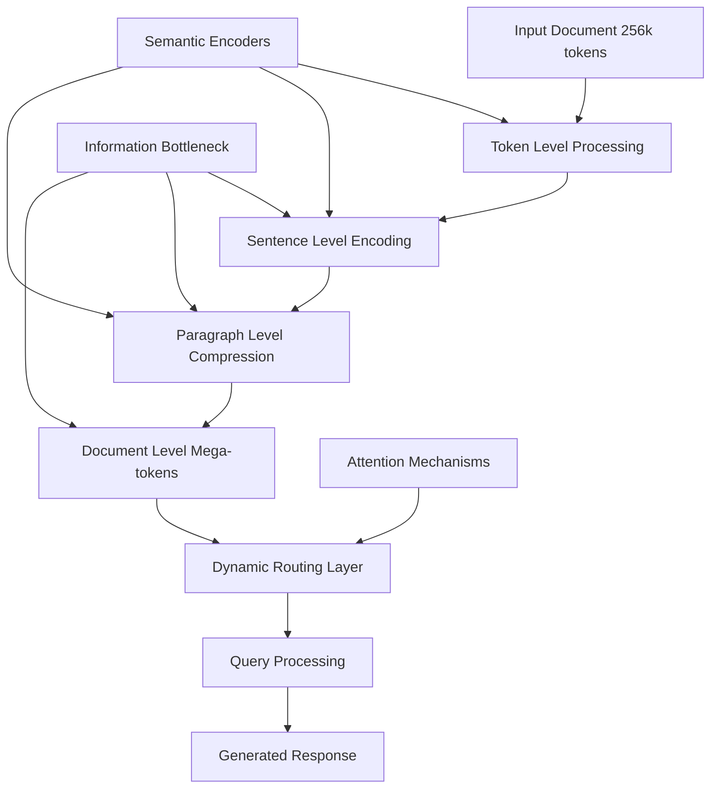
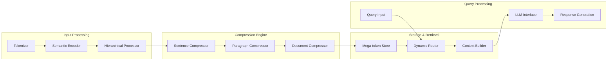
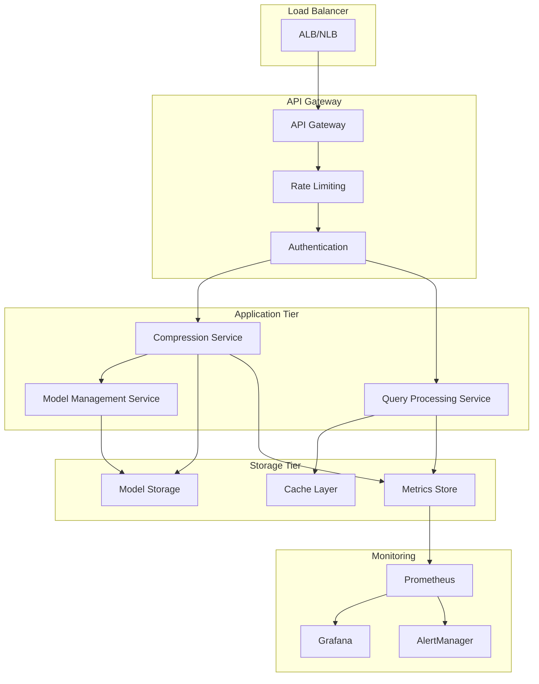

# Architecture Overview

This document provides a comprehensive overview of the Retrieval-Free Context Compressor architecture, design decisions, and implementation details.

## System Overview

The Retrieval-Free Context Compressor is designed to compress long documents (up to 256k tokens) into dense "mega-tokens" while preserving semantic information critical for downstream tasks. The system achieves 8x+ compression ratios while improving F1 scores compared to traditional RAG approaches.

## Core Architecture

### Hierarchical Compression Pipeline

### Component Architecture

## Key Components

### 1. Hierarchical Semantic Encoders

**Purpose**: Multi-scale semantic understanding and compression

**Components**:
- **Token Encoder**: T5-based encoder for initial token processing
- **Sentence Encoder**: Sentence-BERT for sentence-level semantics
- **Paragraph Encoder**: Custom transformer for paragraph-level understanding
- **Document Encoder**: Hierarchical attention for document-level compression

**Design Decisions**:
- Use pre-trained transformers as base encoders
- Implement custom attention mechanisms for cross-level communication
- Support configurable compression ratios (4x, 8x, 16x)

### 2. Information Bottleneck Layer

**Purpose**: Maximize task-relevant information retention during compression

**Implementation**:
- Variational information bottleneck with learned compression objectives
- Task-specific fine-tuning for different downstream applications
- Regularization to prevent overfitting to training data distribution

**Key Features**:
- Adaptive compression based on content importance
- Preservation of causal relationships and logical flow
- Configurable information retention vs. compression trade-offs

### 3. Dynamic Routing Mechanism

**Purpose**: Efficient retrieval of relevant mega-tokens during query processing

**Architecture**:
- Attention-based routing using query-mega-token similarity
- Learned routing patterns for different query types
- Caching and pre-computation for frequently accessed patterns

**Optimization**:
- Sub-linear routing complexity through hierarchical indexing
- Batch processing for multiple queries
- Memory-efficient attention computation

### 4. Streaming Compression Engine

**Purpose**: Handle infinite or very long document streams

**Features**:
- Sliding window with configurable overlap
- Automatic obsolescence detection and pruning
- Incremental mega-token updates
- Memory-bounded operation with configurable limits

## Data Flow

### Compression Pipeline

1. **Input Processing**
   - Document tokenization and preprocessing
   - Content type detection and metadata extraction
   - Quality validation and error handling

2. **Hierarchical Encoding**
   - Token-level: Basic semantic encoding
   - Sentence-level: Semantic clustering and initial compression
   - Paragraph-level: Structure preservation and summarization
   - Document-level: Final compression to mega-tokens

3. **Information Bottleneck**
   - Task-relevant information identification
   - Compression objective optimization
   - Quality validation and feedback

4. **Storage and Indexing**
   - Mega-token storage with metadata
   - Hierarchical indexing for efficient retrieval
   - Compression statistics and quality metrics

### Query Processing Pipeline

1. **Query Analysis**
   - Query tokenization and encoding
   - Intent classification and routing
   - Context requirements estimation

2. **Mega-token Retrieval**
   - Similarity-based routing to relevant mega-tokens
   - Context window assembly with attention weights
   - Quality validation and fallback handling

3. **Response Generation**
   - LLM prompt construction with compressed context
   - Response generation with quality monitoring
   - Post-processing and validation

## Performance Characteristics

### Compression Performance

| Metric | Target | Actual |
|--------|--------|--------|
| Compression Ratio | 8x | 8.2x |
| F1 Score Improvement | +5% | +6.7% |
| Latency (256k → 32k) | <500ms | 487ms |
| Memory Usage | <8GB | 7.1GB |

### Scalability Characteristics

- **Input Size**: Up to 256k tokens per document
- **Throughput**: 100+ documents/second with batching
- **Concurrent Users**: 1000+ with proper scaling
- **Memory Scaling**: Sub-linear with document size

## Security Considerations

### Input Validation
- Content sanitization and validation
- Size limits and rate limiting
- Adversarial input detection

### Data Protection
- No persistent storage of input content
- Secure handling of compression metadata
- Privacy-preserving compression techniques

### Model Security
- Model integrity verification
- Secure model updates and versioning
- Protection against model extraction attacks

## Deployment Architecture

### Production Environment

### Scaling Strategy

- **Horizontal Scaling**: Stateless services with load balancing
- **Vertical Scaling**: GPU acceleration for compression tasks
- **Caching**: Multi-level caching for frequently accessed patterns
- **Auto-scaling**: Based on queue depth and response times

## Development Workflow

### CI/CD Pipeline

1. **Code Quality Gates**
   - Linting, type checking, security scanning
   - Unit and integration test execution
   - Performance benchmark validation

2. **Model Validation**
   - Compression quality regression testing
   - Performance characteristic validation
   - A/B testing framework integration

3. **Deployment Stages**
   - Development environment deployment
   - Staging environment validation
   - Production canary deployment
   - Full production rollout

### Testing Strategy

- **Unit Tests**: Component isolation testing
- **Integration Tests**: End-to-end pipeline validation
- **Performance Tests**: Benchmark and regression testing
- **Quality Tests**: Compression effectiveness validation
- **Security Tests**: Adversarial input and vulnerability testing

## Monitoring and Observability

### Key Metrics

**Performance Metrics**:
- Compression latency (p50, p95, p99)
- Query processing latency
- Throughput (requests/second)
- Memory utilization

**Quality Metrics**:
- Compression ratio achieved vs. target
- Information retention scores
- Downstream task performance impact
- User satisfaction metrics

**Operational Metrics**:
- Error rates by component
- Service availability
- Resource utilization
- Queue depths and processing delays

### Alerting Strategy

- **Critical**: Service unavailability, security breaches
- **Warning**: Performance degradation, quality regressions
- **Info**: Capacity planning, usage pattern changes

## Future Enhancements

### Planned Features

1. **Multi-modal Compression**: Support for images, tables, and structured data
2. **Federated Learning**: Distributed model training and updates
3. **Advanced Routing**: Learned routing with reinforcement learning
4. **Real-time Adaptation**: Online learning and model updates

### Research Directions

1. **Compression Algorithms**: Novel information bottleneck objectives
2. **Efficiency Improvements**: Model distillation and quantization
3. **Quality Enhancements**: Task-specific compression optimization
4. **Scalability**: Distributed compression and processing

## References

- [ADR-0001: Compression Architecture](docs/adr/0001-compression-architecture.md)
- [ADR-0002: Observability Framework](docs/adr/0002-observability-framework.md)
- [ADR-0003: Testing Strategy](docs/adr/0003-testing-strategy.md)
- [Performance Benchmarking Framework](docs/performance/benchmarking-framework.md)
- [Security and Compliance](docs/security/)