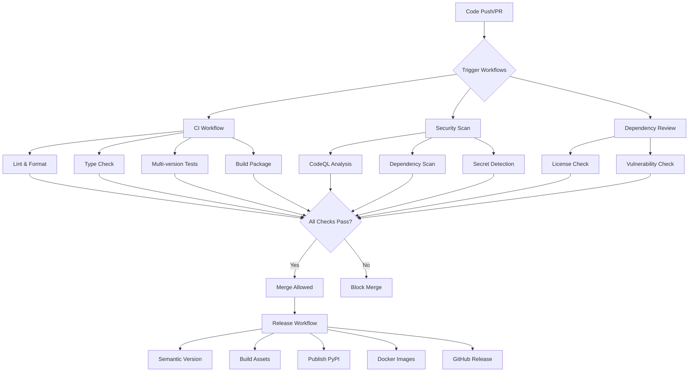

# GitHub Workflows Guide

Comprehensive guide to the GitHub Actions workflows for the Retrieval-Free Context Compressor project.

## Workflow Overview

Our CI/CD pipeline consists of multiple interconnected workflows designed for maximum reliability, security, and performance.



## Core Workflows

### 1. Continuous Integration (ci.yml)

**Triggers**: Push to main, Pull Requests
**Purpose**: Code quality validation and testing

#### Jobs Structure
```yaml
jobs:
  lint:           # Code formatting and style
  test:           # Multi-version testing (3.10, 3.11, 3.12)
  build:          # Package building and validation
```

#### Key Features
- **Parallel Testing**: Tests run across Python 3.10, 3.11, and 3.12
- **Caching**: Dependencies cached for faster builds
- **Coverage**: Code coverage with 80% minimum threshold
- **Artifacts**: Build artifacts uploaded for debugging

#### Configuration
```yaml
# Customize Python versions
strategy:
  matrix:
    python-version: ["3.10", "3.11", "3.12"]

# Adjust coverage threshold
run: pytest --cov-fail-under=80
```

### 2. Security Scanning (security.yml)

**Triggers**: Push, Pull Request, Schedule (weekly)
**Purpose**: Comprehensive security analysis

#### Security Layers
1. **SAST**: Static Application Security Testing with CodeQL
2. **Dependency Scanning**: Known vulnerability detection
3. **Secret Detection**: Credential and API key scanning
4. **License Compliance**: Open source license validation

#### Advanced Configuration
```yaml
# CodeQL configuration
- name: Initialize CodeQL
  uses: github/codeql-action/init@v2
  with:
    languages: python
    queries: security-extended,security-and-quality

# Custom vulnerability thresholds
- name: Run vulnerability scan
  with:
    severity-cutoff: medium
    exit-code: 1
```

### 3. Dependency Management (dependency-review.yml)

**Triggers**: Pull Requests
**Purpose**: Automated dependency risk assessment

#### Review Criteria
- **License Policy**: Ensure compatible licenses
- **Security**: Block high/critical vulnerabilities
- **Quality**: Assess dependency health scores
- **Supply Chain**: Verify package authenticity

#### Policy Configuration
```yaml
# License allowlist
allowed-licenses:
  - MIT
  - Apache-2.0
  - BSD-3-Clause
  - ISC

# Vulnerability thresholds
fail-on-severity: high
fail-on-scopes: [runtime, development]
```

### 4. Container Workflows (docker.yml)

**Triggers**: Push to main, Release tags
**Purpose**: Multi-architecture container builds

#### Build Matrix
- **Platforms**: linux/amd64, linux/arm64
- **Targets**: development, production
- **Registries**: Docker Hub, GitHub Container Registry

#### Security Features
- **Image Scanning**: Trivy vulnerability scanner
- **SBOM Generation**: Software Bill of Materials
- **Image Signing**: Cosign signature verification
- **Base Image Updates**: Automated security patches

#### Multi-Registry Push
```yaml
# Docker Hub
- name: Push to Docker Hub
  uses: docker/build-push-action@v4
  with:
    tags: |
      rfcc/retrieval-free-context-compressor:latest
      rfcc/retrieval-free-context-compressor:${{ github.ref_name }}

# GitHub Container Registry  
- name: Push to GHCR
  with:
    tags: |
      ghcr.io/${{ github.repository }}:latest
      ghcr.io/${{ github.repository }}:${{ github.ref_name }}
```

### 5. Release Automation (release.yml)

**Triggers**: Push to main (with conventional commits)
**Purpose**: Automated semantic releases

#### Release Pipeline
1. **Analysis**: Conventional commit analysis
2. **Versioning**: Semantic version calculation
3. **Assets**: Build and package artifacts
4. **Publishing**: Multi-platform distribution
5. **Notification**: Release announcements

#### Conventional Commits
```bash
# Version bumps
feat: new feature         # Minor version
fix: bug fix             # Patch version
BREAKING CHANGE:         # Major version

# No version bump
docs: documentation      # No release
style: formatting        # No release
test: add tests         # No release
```

#### Release Assets
- Python wheels (.whl)
- Source distribution (.tar.gz)
- Docker images (multi-arch)
- SBOM files
- Security scan reports

### 6. Performance Testing (performance.yml)

**Triggers**: Schedule (nightly), Manual dispatch
**Purpose**: Performance regression detection

#### Benchmark Suites
- **Compression Performance**: Ratio and speed metrics
- **Memory Usage**: Peak and average consumption
- **Latency**: Request/response timing
- **Throughput**: Documents processed per second

#### Regression Detection
```yaml
# Performance thresholds
compression_ratio_min: 8.0
latency_95th_percentile_max: 500ms
memory_usage_max: 8GB
throughput_min: 100doc/min
```

## Workflow Customization

### Environment Variables

#### Global Configuration
```yaml
env:
  PYTHON_VERSION: "3.10"
  NODE_VERSION: "18"
  DOCKER_BUILDKIT: 1
  COMPOSE_DOCKER_CLI_BUILD: 1
```

#### Job-Specific Variables
```yaml
jobs:
  test:
    env:
      PYTEST_ADDOPTS: "-v --tb=short"
      COVERAGE_THRESHOLD: 80
```

### Matrix Strategies

#### Python Version Testing
```yaml
strategy:
  fail-fast: false
  matrix:
    python-version: ["3.10", "3.11", "3.12"]
    os: [ubuntu-latest, windows-latest, macos-latest]
    include:
      - python-version: "3.10"
        experimental: false
      - python-version: "3.12"  
        experimental: true
```

#### Docker Build Matrix
```yaml
strategy:
  matrix:
    platform: [linux/amd64, linux/arm64]
    target: [development, production]
```

### Conditional Execution

#### Branch-Based Conditions
```yaml
# Only on main branch
if: github.ref == 'refs/heads/main'

# Only on pull requests
if: github.event_name == 'pull_request'

# Only on release tags
if: startsWith(github.ref, 'refs/tags/v')
```

#### File-Based Conditions
```yaml
# Only if Python files changed
if: contains(github.event.head_commit.modified, '.py')

# Only if dependencies changed
if: contains(github.event.head_commit.modified, 'pyproject.toml')
```

## Secrets Management

### Required Secrets

#### CI/CD Secrets
```bash
CODECOV_TOKEN=<codecov_upload_token>
PYPI_API_TOKEN=<pypi_publishing_token>
DOCKER_USERNAME=<docker_hub_username>
DOCKER_PASSWORD=<docker_hub_token>
```

#### Security Secrets
```bash
COSIGN_PRIVATE_KEY=<image_signing_key>
COSIGN_PASSWORD=<key_password>
SENTRY_DSN=<error_tracking_url>
```

#### Notification Secrets
```bash
SLACK_WEBHOOK_URL=<team_notifications>
DISCORD_WEBHOOK_URL=<community_notifications>
```

### Secret Rotation

1. **Monthly**: Rotate service tokens
2. **Quarterly**: Update signing keys
3. **On Breach**: Immediate rotation protocol

## Performance Optimization

### Build Caching

#### Dependency Caching
```yaml
- name: Cache Python dependencies
  uses: actions/cache@v3
  with:
    path: ~/.cache/pip
    key: ${{ runner.os }}-pip-${{ hashFiles('**/pyproject.toml') }}
    restore-keys: |
      ${{ runner.os }}-pip-
```

#### Docker Layer Caching
```yaml
- name: Set up Docker Buildx
  uses: docker/setup-buildx-action@v2
  with:
    driver-opts: image=moby/buildkit:latest
    buildkitd-flags: --allow-insecure-entitlement security.insecure
```

### Parallelization

#### Job Dependencies
```yaml
jobs:
  lint:
    runs-on: ubuntu-latest
    
  test:
    runs-on: ubuntu-latest
    needs: lint  # Wait for lint to pass
    
  build:
    runs-on: ubuntu-latest
    needs: [lint, test]  # Wait for both
```

#### Matrix Parallelization
```yaml
# Runs 3 jobs in parallel (Python 3.10, 3.11, 3.12)
strategy:
  matrix:
    python-version: ["3.10", "3.11", "3.12"]
```

## Monitoring and Alerting

### Workflow Monitoring

#### Success Rate Tracking
```yaml
- name: Report success
  if: success()
  run: |
    curl -X POST "$MONITORING_WEBHOOK" \
      -d "workflow=ci&status=success&duration=${{ job.duration }}"
```

#### Failure Notifications
```yaml
- name: Notify on failure
  if: failure()
  uses: actions/slack@v1
  with:
    webhook: ${{ secrets.SLACK_WEBHOOK_URL }}
    message: "CI workflow failed on ${{ github.ref }}"
```

### Performance Monitoring

#### Build Time Tracking
```yaml
- name: Track build time
  run: |
    echo "BUILD_START_TIME=$(date +%s)" >> $GITHUB_ENV
    
# Later in the workflow
- name: Report build time
  run: |
    BUILD_END_TIME=$(date +%s)
    BUILD_DURATION=$((BUILD_END_TIME - BUILD_START_TIME))
    echo "Build took ${BUILD_DURATION} seconds"
```

## Troubleshooting

### Common Issues

#### 1. Test Failures
```bash
# Debug test failures
pytest -v --tb=long --no-cov

# Run specific test
pytest tests/test_specific.py::test_function -v
```

#### 2. Docker Build Issues
```bash
# Enable buildkit debug
export BUILDKIT_PROGRESS=plain

# Check available platforms
docker buildx ls

# Inspect build cache
docker buildx du
```

#### 3. Permission Errors
```yaml
# Fix checkout permissions
- uses: actions/checkout@v4
  with:
    token: ${{ secrets.GITHUB_TOKEN }}
    persist-credentials: true
```

### Debugging Strategies

#### 1. Enable Debug Logging
```yaml
- name: Enable debug logging
  run: echo "ACTIONS_STEP_DEBUG=true" >> $GITHUB_ENV
```

#### 2. SSH into Runner
```yaml
# For debugging (remove before commit)
- name: Setup tmate session
  uses: mxschmitt/action-tmate@v3
  if: failure()
```

#### 3. Artifact Collection
```yaml
- name: Upload debug artifacts
  if: failure()
  uses: actions/upload-artifact@v3
  with:
    name: debug-logs
    path: |
      logs/
      *.log
      test-results/
```

## Best Practices

### Security
1. **Least Privilege**: Minimal required permissions
2. **Secret Rotation**: Regular credential updates
3. **Dependency Scanning**: Automated vulnerability detection
4. **Image Signing**: Container integrity verification

### Performance
1. **Caching**: Aggressive dependency caching
2. **Parallelization**: Maximum job concurrency
3. **Optimization**: Efficient build processes
4. **Monitoring**: Performance regression detection

### Reliability
1. **Retry Logic**: Automatic failure recovery
2. **Timeout Protection**: Prevent hanging jobs
3. **Resource Limits**: CPU and memory constraints
4. **Health Checks**: Service availability validation

### Maintainability
1. **Documentation**: Comprehensive workflow docs
2. **Modularity**: Reusable workflow components
3. **Versioning**: Pinned action versions
4. **Testing**: Workflow validation procedures